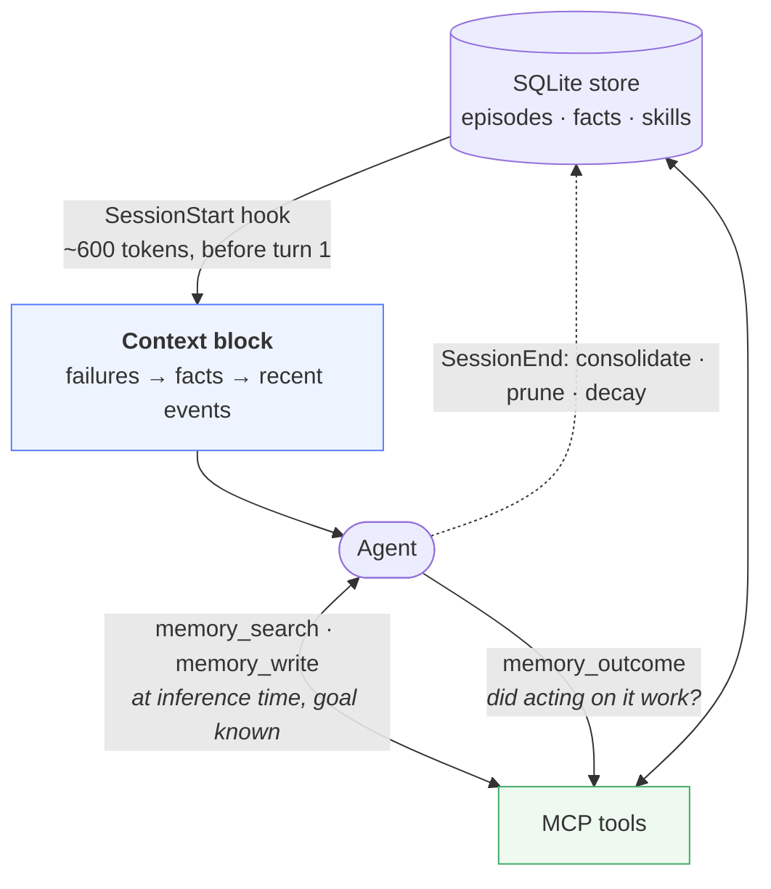
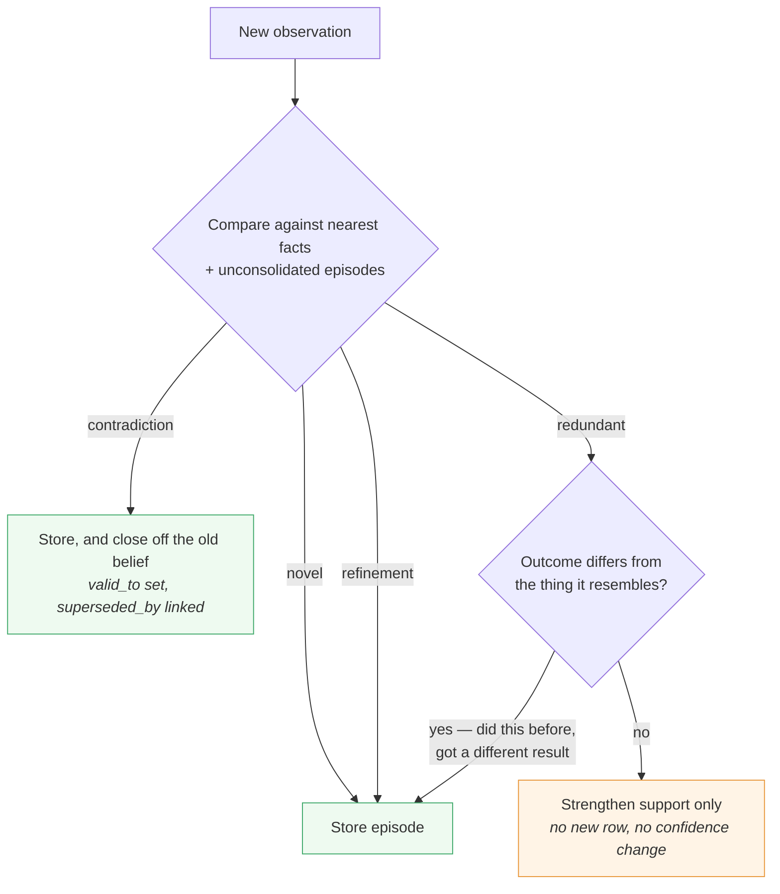
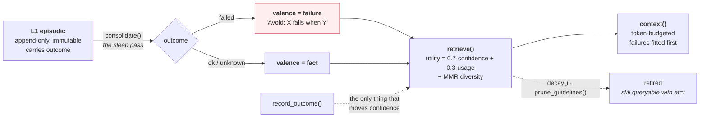

# brainmem

[](https://github.com/Jimmycarroll2021/Brainmem/actions/workflows/ci.yml)
[](https://pypi.org/project/brainmem/)
[](https://www.python.org/downloads/)
[](LICENSE)

**Long-term memory for LLM agents that gets more useful as it grows, instead of less.**

## The problem

Your agent starts every session knowing nothing. So you explain it again: the deploy
takes twenty minutes, the client wants fortnightly reports, we already tried
chunking that CSV and it timed out.

The obvious fix is to save everything and paste it back next time. That works for
about a week. Then three things go wrong, and they compound:

- **The context fills up with the same fact eleven different ways.** Every
  restatement takes a slot, and slots are the scarce resource — not disk. What gets
  crowded out is the one thing the agent actually needed.
- **It confidently repeats things that stopped being true.** Priya left the project
  in March. The agent still routes questions to her, because *"Priya leads
  Education"* is in the store and nothing ever retired it.
- **It remembers what worked and forgets what broke.** Failures are the expensive
  lessons. Most memory systems only ever record successes.

None of this looks like a failure from the outside. The agent still answers
immediately and sounds certain. It's just wrong more often, and you can't tell why
because you can't see where any given belief came from.

## What brainmem does about it

| The failure | The mechanism |
|---|---|
| Context fills with restatements | **Writes are gated on surprise.** If the store already predicts what you just told it, it strengthens the existing belief rather than adding a row. Repetition raises support; it never invents new evidence. |
| Stale beliefs never die | **Every belief has a validity interval.** A contradiction closes the old one and links its replacement. Nothing is deleted — so you can still ask what the agent believed last Tuesday, and on what evidence. |
| Failures get lost | **Failures are a separate class.** They distil under their own prompt, rank separately, and are fitted into the context budget *before* successes — so when space runs out, the expensive lessons are the last thing dropped. |

The through-line: **storage is free, attention is not.** A memory system's real job
is deciding what *not* to say, and being auditable about what it did say.

## See it

```python
from brainmem import Memory

m = Memory("memory.db")
m.encode("Validation of the 60MB CSV timed out.", outcome=False)
m.encode("Chunking the CSV to 20MB completed validation.", outcome=True)
m.consolidate()                      # distil raw events into durable beliefs

print(m.context("run the validation batch", token_budget=600))
```

```
## What has gone wrong before
- [1] Avoid: Validation of the 60MB CSV timed out  (unverified, n=1)

## What I know
- [2] Chunking the CSV to 20MB completed validation  (conf 0.60, n=1)
```

The failure leads. The `[id]` on each line is how the agent reports back whether
acting on it actually worked:

```python
m.record_outcome(2, success=True)    # this is the part that makes it learn
```

Say the same thing again and it won't be stored twice — but say it again *with a
different outcome* and it will be, because "I did this before and got a different
result" is the most informative thing that can happen to a belief.

## Install

```bash
pip install brainmem
```

Optional extras: `pip install 'brainmem[embeddings]'` for real semantic retrieval,
`'brainmem[mcp]'` for the MCP server, `'brainmem[anthropic]'` for the LLM write gate.

From the shell: `brainmem encode "..." --outcome fail`, `brainmem retrieve "..."`,
`brainmem stats`, `brainmem explain 3`.

## Using it with Claude Code

```bash
git clone https://github.com/Jimmycarroll2021/Brainmem && cd Brainmem
./install.sh
```

That gives the agent memory two ways in:



**The hook is the floor.** It injects ~600 tokens before the first turn, when the
goal is still unknown — so it stays deliberately small rather than guessing.

**The MCP tools are the ceiling.** `memory_search`, `memory_write`,
`memory_outcome`, `memory_explain`, `memory_status` defer retrieval to inference
time, when the agent knows what it's doing.

`install.sh` generates a settings block with absolute, native paths and prints where
to merge it. Don't hand-edit those paths: Claude Code expands variables in
`.mcp.json` but **not** in `settings.json`, so a `$HOME` placeholder leaves the hook
silently dead — and a Git Bash `/c/Users/...` path fails the same way on Windows.
Append to any `SessionStart` array you already have rather than replacing it.

## How it decides what to keep

The highest-leverage decision is what *not* to store.



## How a raw event becomes a belief



| Layer | Role | Key property |
|---|---|---|
| L0 working | assembled context | token-budgeted, never persisted |
| L1 episodic | append-only event log | immutable, carries outcome |
| L2 semantic | distilled propositions | validity intervals, provenance, valence |
| L3 procedural | cached action sequences | scored by success rate |
| core | pinned identity | always loaded |

Consolidation is deliberately offline — the "sleep pass" — because finding the
invariant across events needs several events at once. It runs on `SessionEnd`.

## The catch you should know about before adopting this

The outcome channel is what makes ranking mean anything: beliefs are ordered by
having *been right*, not by looking relevant. But **in a simulator the oracle is
free, and in real advisory or analytical work there is no oracle.** Nothing emits
`success=True` when you write a strategy memo.

So you have to supply it — a human verdict, a downstream check, a test result.
Everything degrades gracefully to `outcome=None`, but the mechanisms carrying most
of the measured gain are exactly the ones that need the signal. Wiring
`memory_outcome` into a real workflow is the difference between this being useful
and being decoration.

Related: only record an outcome you actually observed. That a belief was *relevant*
or load-bearing is not evidence it was *true*, and recording it as one inflates
confidence in something nothing has checked.

## Where this sits

Agent memory is crowded and most of it is bigger than this. brainmem is deliberately
small: one readable Python module, numpy as the only required dependency, SQLite on
disk, no service to run.

**Use something else if** you want a managed service, multi-tenant user profiles, or
a knowledge graph over a large corpus. [mem0](https://github.com/mem0ai/mem0),
[cognee](https://github.com/topoteretes/cognee), [Letta](https://github.com/letta-ai/letta)
and [Zep](https://github.com/getzep/zep) are all larger, more featureful and more
production-hardened than this is. [HippoRAG](https://github.com/OSU-NLP-Group/HippoRAG)
is the research-grade take on memory-inspired retrieval.

**Use this if** you want something you can read end to end in an afternoon, audit the
provenance of every belief, and wire into Claude Code with one command.

## Defaults worth knowing

- `retrieve(k=3)` — retrieval quality saturates fast (74% at k=1, 82% at k=2, flat
  at k=3 and k=5 in Ma et al., 2026). Raise only with evidence.
- `context()` orders each block in a serial-position V — best material at the head
  and tail, because the middle of a context window is where things go to be ignored
  (Liu et al., 2023, *Lost in the Middle*).
- Failures are fitted to the budget before facts, so under pressure they're last out.
- `prune_guidelines(keep=20)` caps outcome-scored rules; anything ≥0.8 confidence
  with ≥5 successes is protected.
- Ma et al. ablated failure memory: removing failure reasons cost 8 points, removing
  success patterns cost 2. That asymmetry is why failures are first-class here.

## Production swaps, in order of impact

1. **Real embedder** — shipped. `pip install 'brainmem[embeddings]'`, then
   `BRAINMEM_EMBEDDER=sentence-transformers`. The `HashEmbedder` default is hashed
   n-grams with no semantic generalisation, so "the batch aborted" and "the job
   failed" share no vector mass. Switching changes the vector dimension — start a
   fresh store.
2. **`BRAINMEM_LLM=anthropic`** for the write gate and extractor. The heuristic judge
   cannot reliably detect contradiction, and a cosine threshold structurally can't:
   "X leads the project" and "X has left the project" embed almost identically.
3. **pgvector or FAISS** past roughly 20k live facts. `_nearest_facts` is an O(n)
   brute-force scan and only it changes. Measured on a laptop with `python bench.py`:
   ~32ms per retrieve at 10k facts, ~219ms at 50k, ~442ms at 100k. `context()` runs
   on every SessionStart, so it is the number that shows up as a stall — about 60ms
   at 10k and half a second at 50k.

## Found by testing, not by reading

A sample of bugs that unit tests could not have caught, because the failure was in
the seam rather than the function — and every one of them was **silent**:

- **Stored memory could forge its own envelope.** `context()` is injected wrapped
  in `<memory source="brainmem">…</memory>`, and the "this is evidence, not
  instruction" caveat lives *inside* that block. A stored proposition containing a
  closing tag pushed everything after it outside the wrapper, where the caveat no
  longer applied — and memory is replayed at every session start, so unlike ordinary
  prompt injection it persisted. Anything that can write to memory could do it: a
  poisoned tool result, a page the agent read, a file it summarised. Tag-like
  sequences are now neutralised on the assembled block.
- **The embedding hash was salted per process.** `HashEmbedder` used builtin
  `hash()`, which Python salts per process (PEP 456). Every deployment path — the
  hook, the CLI, the MCP server — is a separate process over one database, so
  vectors written by one session were meaningless to the next. The store still
  returned rows in the right shape; the same query that ranked a failure lesson
  first in-process ranked it *fourth* from a fresh process.
- **Confidence rose on restatement, not evidence.** The gate decides redundancy by
  string similarity, which cannot tell a paraphrase from a caveat. Recording
  *"the thirty percent rule is not a demonstrated optimum"* made the store **more**
  certain of the thirty percent rule.
- **The SessionStart hook read its goal from `$1`.** Claude Code delivers hook
  payloads as JSON on stdin and never passes argv, so the goal was always empty and
  silently fell back to the directory name. The block still rendered — it just
  stopped being goal-conditioned. Every test passed the goal as `$1`, which is
  exactly why none of them saw it.
- **`$HOME` in `settings.json` is never expanded**, and a Git Bash `/c/Users/...`
  path fails the same way. Both install cleanly and then never fire.

The full list is in [CONTRIBUTING.md](CONTRIBUTING.md), along with why there are
four separate test suites rather than one.

## Verify

```bash
python test_brainmem.py   # 44 library invariants
bash smoke_test.sh        # 29 checks — install, hooks, cross-process persistence
python e2e_mcp.py         # 22 checks — spawns the real MCP server over stdio
python demo.py            # full lifecycle, no API key needed
```

Green on Linux, macOS and Windows across Python 3.10–3.13.

## Security

brainmem writes text into a model's context and replays it at the start of every
future session, which makes it a **persistence layer for prompt injection**. A normal
injection lasts one turn; one that reaches memory lasts until someone deletes the row.
Envelope forgery and unbounded writes are defended against; believable false
statements are not, because the gate tests novelty rather than truth.

Read [SECURITY.md](SECURITY.md) before pointing `memory_write` at anything untrusted.

## What remains unproven

Surprisal-gated writes are principled, but I know of no clean benchmark showing they
beat write-everything at scale. Ma et al. don't test it either — their episodic store
grows monotonically. If you find or run such a benchmark, that's the result most
likely to change this design.

## License

Apache 2.0.
